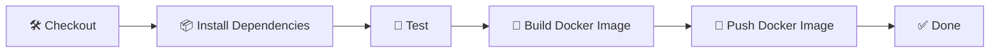

# 🔄 CI/CD Pipeline with Jenkins & Docker 🚀

> An end-to-end **Continuous Integration / Continuous Delivery** pipeline that builds, tests, and ships a **Node.js Express** application using **Jenkins** 🏗️ and **Docker** 🐳.


---

## 📋 Table of Contents

- [✨ Overview](#-overview)
- [🧩 Tech Stack](#-tech-stack)
- [📁 Project Structure](#-project-structure)
- [🚀 Getting Started](#-getting-started)
  - [1️⃣ Run Locally (Node.js)](#1-run-locally-nodejs)
  - [2️⃣ Run with Docker](#2-run-with-docker)
- [🐳 Dockerfile Explained](#-dockerfile-explained)
- [🏗️ Jenkins CI/CD Pipeline](#-jenkins-cicd-pipeline)
  - [Pipeline Stages](#pipeline-stages)
- [⚙️ Jenkins Setup Guide](#-jenkins-setup-guide)
  - [Prerequisites](#prerequisites)
  - [Creating the Pipeline](#creating-the-pipeline)
  - [Configuration Parameters](#configuration-parameters)
- [✅ Testing](#-testing)
- [🌐 Application Endpoints](#-application-endpoints)
- [📚 Useful Commands](#-useful-commands)
- [🤝 Contributing](#-contributing)
- [📄 License](#-license)
---

## ✨ Overview

This repository demonstrates a **production-ready CI/CD setup** for a simple **Node.js (Express)** web application:

- 🔍 **Continuous Integration (CI)** — automatically installs dependencies and runs unit tests on every change.
- 🚢 **Continuous Delivery (CD)** — builds a Docker image, tags it, and (optionally) pushes it to a container registry.
- 🐳 **Containerization** — the app is packaged into a lightweight Docker image using a multi-stage `Dockerfile`.

The whole flow is orchestrated by a **Jenkinsfile** (Declarative Pipeline), so the build, test, and deployment steps are fully automated and reproducible across Linux and Windows agents. 🎯

---

## 🧩 Tech Stack

| Layer       | Technology                          |
| ----------- | ----------------------------------- |
| 🟢 Runtime   | Node.js + Express 5                  |
| ⚙️ Test      | Mocha + Supertest                    |
| 🐳 Container | Docker                              |
| 🏗️ CI/CD    | Jenkins (Declarative Pipeline)       |
| 📦 Registry  | Docker Hub (or any Docker registry) |
---

## 📁 Project Structure

```
CI-CD-Pipeline/
├── 📄 Dockerfile          # Builds the Node.js app image
├── 📄 Jenkinsfile         # Declarative CI/CD pipeline
├── 📄 .dockerignore       # Excludes files from the Docker build context
├── 📄 .gitignore          # Git ignore rules (node_modules, etc.)
├── 📄 README.md           # You are here 👋
└── 📁 node_app/           # Node.js Express application
    ├── 🚪 index.js        # App entry point (Express server)
    ├── 📦 package.json    # Project metadata & dependencies
    ├── 🔒 package-lock.json
    └── 🧪 test/
        └── test.js        # API unit tests (Mocha + Supertest)
```

---

## 🚀 Getting Started

### 1️⃣ Run Locally (Node.js)

> Prerequisite: **[Node.js](https://nodejs.org/)** (LTS recommended) installed. 🟢

```bash
# 1. Navigate into the app folder
cd node_app

# 2. Install dependencies
npm install

# 3. Start the development server (nodemon, auto-reloads)
npm start
```

The server will be available at **http://localhost:3000** 🌍

### 2️⃣ Run with Docker

> Prerequisite: **[Docker](https://www.docker.com/)** installed and running. 🐳

```bash
# 1. Build the Docker image from the project root
docker build -t ci-cd-pipeline-node-app .

# 2. Run the container (map host port 3000 to container port 3000)
docker run -p 3000:3000 ci-cd-pipeline-node-app
```

Open **http://localhost:3000** in your browser to see the app. 🎉
---

## 🐳 Dockerfile Explained

The `Dockerfile` packages the app into a clean, runnable image. 🧹

| Instruction            | Purpose                                                        |
| ---------------------- | -------------------------------------------------------------- |
| `FROM node:latest`     | Base image with the latest Node.js.                           |
| `WORKDIR /app`         | Sets the working directory inside the container.              |
| `COPY node_app/* /app/`| Copies application files into the container.                  |
| `RUN npm install`      | Installs dependencies defined in `package.json`.              |
| `EXPOSE 3000`          | Declares the port the app listens on.                         |
| `CMD ["npm", "start"]` | Starts the server when the container runs.                    |

> 💡 The `.dockerignore` file ensures `node_modules` and other local files are **not** copied into the build context, keeping the build fast and the image light.

---

## 🏗️ Jenkins CI/CD Pipeline

The pipeline is defined in **`Jenkinsfile`** using the **Declarative Pipeline** syntax. It is cross-platform and runs on both Linux agents (`sh`) and Windows agents (`bat`). 🖥️

### Pipeline Stages



| # | Stage                     | What it does 💡                                                                             |
| - | ------------------------- | ------------------------------------------------------------------------------------------ |
| 1 | 🛠️ **Checkout**            | Pulls the source code from the GitHub repository (`main` branch).                           |
| 2 | 📦 **Install Dependencies** | Runs `npm ci` (if a lockfile exists) or `npm install` inside `node_app`.                   |
| 3 | 🧪 **Test**                 | Runs the test suite (`npm test` → Mocha + Supertest).                                       |
| 4 | 🐳 **Build Docker Image**   | Builds the image tagged as `<IMAGE_REPOSITORY>:<BUILD_NUMBER>`.                            |
| 5 | 🚀 **Push Docker Image**    | Logs into the registry and pushes the image (only if `PUSH_IMAGE` is enabled).             |

> ✅ The `post` block logs a success or failure message after every run, so you always know the outcome at a glance.
---

## ⚙️ Jenkins Setup Guide

### Prerequisites

- ✅ A running **Jenkins** server with the **Pipeline** plugin installed.
- ✅ The agent (build machine) must have **Node.js** and **Docker** available.
- ✅ (Optional) A **container registry** account plus a **Jenkins credentials ID** for pushing images.

### Creating the Pipeline

1. In Jenkins, click **New Item** ➜ name it (e.g. `CI-CD-Pipeline`) ➜ choose **Pipeline** ➜ **OK**. 🆕
2. Scroll to the **Pipeline** section.
3. Set **Definition** to **Pipeline script from SCM**.
4. Set **SCM** to **Git** and enter the repository URL:

   ```text
   https://github.com/madurangaPrabhath/CI-CD-Pipeline.git
   ```

5. Set **Branches to build** to `*/main`.
6. Set **Script Path** to `Jenkinsfile`.
7. Click **Save** 💾 then **Build Now** ▶️.

### Configuration Parameters

The pipeline accepts the following build parameters (settable from the Jenkins UI at build time): ⚙️

| Parameter               | Default                     | Description                                          |
| ----------------------- | --------------------------- | ---------------------------------------------------- |
| `PUSH_IMAGE`            | `false`                     | Whether to push the built image to the registry.     |
| `IMAGE_REPOSITORY`      | `ci-cd-pipeline-node-app`   | Repository name (`username/repository`).             |
| `REGISTRY_URL`          | `https://index.docker.io/v1/` | Registry URL used for login.                       |
| `REGISTRY_CREDENTIALS_ID` | *(empty)*                 | Jenkins credentials ID for registry authentication. |

> 🔐 To enable image pushing: create a **Username/Password** credential in Jenkins, provide its **ID** in `REGISTRY_CREDENTIALS_ID`, and check **`PUSH_IMAGE`**.
---

## ✅ Testing

Tests are written with **Mocha** + **Supertest** and live in `node_app/test/test.js`. Run them with:

```bash
cd node_app
npm test
```

Expected output (passing tests for the API routes `GET /`, `/will`, `/ready`, and a 404 case): 🧪

```text
  API routes
    GET /
      ✔ responds with the welcome message
    GET /will
      ✔ responds with 'Hello World'
    GET /ready
      ✔ responds with 'Great!, It works!'
    GET /unknown
      ✔ returns a 404 for unknown routes


  4 passing
```

---

## 🌐 Application Endpoints

| Method | Route      | Response                                    |
| ------ | ---------- | ------------------------------------------- |
| `GET`  | `/`        | `{ "response": "Hello, Welcome to World" }` |
| `GET`  | `/will`    | `{ "response": "Hello World" }`             |
| `GET`  | `/ready`   | `{ "response": "Great!, It works!" }`       |
| `GET`  | *anything* | `404` → `{ "error": "Not Found" }`          |

---

## 📚 Useful Commands

```bash
# 🐳 List running containers
docker ps

# 🐳 Stop a container by ID/name
docker stop <container-id>

# 🐳 Remove an image
docker rmi ci-cd-pipeline-node-app

# 🏷️ Tag an image (example)
docker tag ci-cd-pipeline-node-app yourusername/ci-cd-pipeline-node-app:1.0.0

# 🚀 Push an image to the registry
docker push yourusername/ci-cd-pipeline-node-app:1.0.0
```

---

## 🤝 Contributing

Contributions are welcome! 🎉 Feel free to open an **issue** 🐞 or submit a **pull request** 🫱🏽‍🫲🏾. Please follow the existing code style and add tests for any new functionality.

---

## 📄 License

This project is licensed under the **ISC** license. See the license field in [`node_app/package.json`](node_app/package.json) for details. 📃

---

<p align="center">Made with 💚 using Node.js, Jenkins & Docker</p>